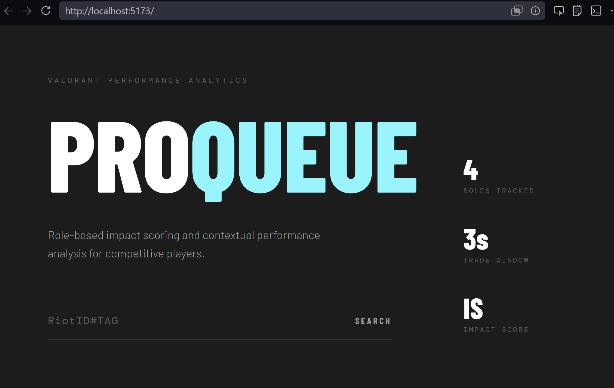
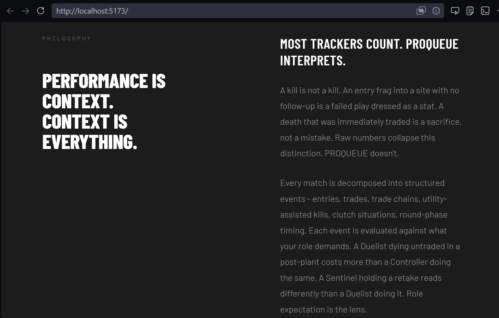
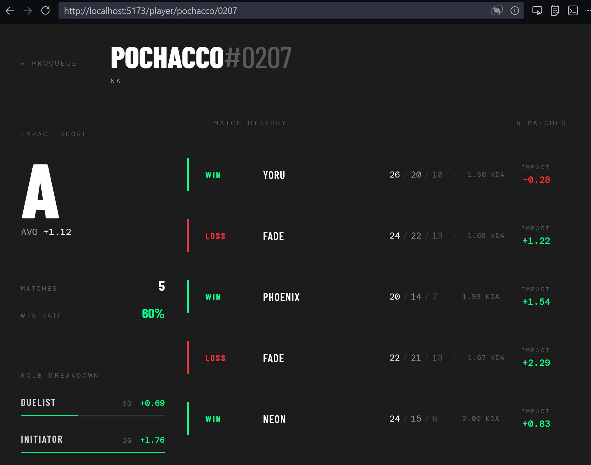

#  PROQUEUE: VALORANT Analytics & Performance Analysis Engine
## Philosophy
PROQUEUE is a systems-oriented product engineering project focused on player performance decomposition, contextual stat modeling, and role-based impact analysis in competitive FPS games.

## Features
- Role-based Impact Score modeling
- Trade detection engine
- Match event decomposition
- Behavioral trend analysis

## PROQUEUE's Modern Architecture
React Frontend
Express API
PostgreSQL
Analytics Engine

## Tech Stack Used
TypeScript
React
Node.js
Express.js
PostgreSQL

## Insider Look into Development
### V1

## Roadmap
Client-side design
Server-side design
Documentation